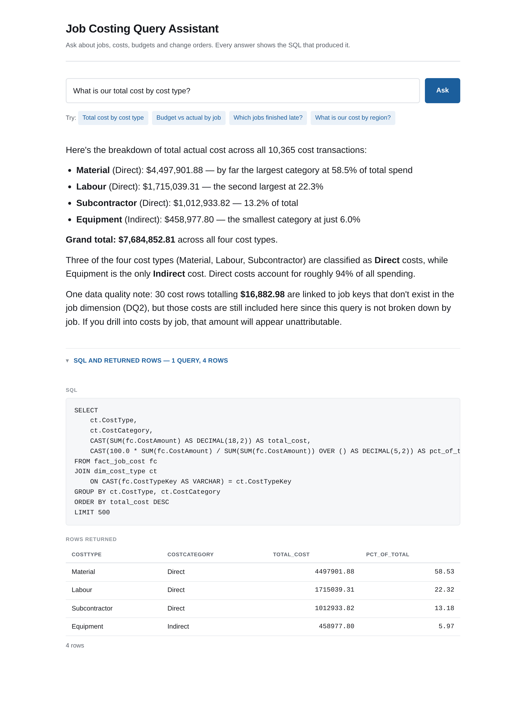

# Job Costing Query Assistant

Ask a question about job costing in plain English. Get an answer in business
language, the SQL that produced it, and the rows it returned.

The point is trustworthy answers, not clever ones. The SQL panel is a feature, not
a debug view: every figure in an answer is meant to be traceable to a query you can
read.



```bash
pip install -r requirements.txt
uvicorn app:main          # http://127.0.0.1:8000
python ask.py "What is our total cost by cost type?"
```

Requires Anthropic API credentials (`ANTHROPIC_API_KEY`, `ANTHROPIC_AUTH_TOKEN`, or
an `ant auth login` profile). `GET /health` reports whether they resolved.

## The data

Seven tables exported from the `lh_job_costing` lakehouse, schema `silver`, read
through DuckDB as views over Parquet in `data/silver/`.

| Table | Role | Grain | Rows |
|---|---|---|---|
| `dim_job` | dimension | one row per job | 52 |
| `dim_cost_type` | dimension | one row per cost type | 4 |
| `dim_employee` | dimension | one row per employee | 45 |
| `dim_date` | dimension | one row per calendar day | 822 |
| `dim_change_order` | fact (despite the name) | one row per change order | 26 |
| `fact_job_budget` | fact | one row per job per cost type | 196 |
| `fact_job_cost` | fact | one row per cost transaction | 10,365 |

There is no TMDL for this model, so `model/model.yaml` is the declaration of
record: roles, grain, keys, relationships, known issues, required query patterns
and the questions the data cannot answer. `scripts/verify_model.py` re-measures
every claim in it against the data and fails if any has drifted.
`scripts/build_schema_context.py` renders it into `model/schema_context.md`, which
is the schema section of the system prompt.

## Guardrails

Every query the model writes passes through `jobcosting/guardrails.py` first.

1. **SELECT and WITH only**, decided by parsing with sqlglot, never by matching
   keywords. `SELECT 'DROP TABLE x'` is allowed; `/* SELECT */ DROP TABLE x` is
   not. A blocklist regex gets both wrong.
2. **Table allowlist derived from `model.yaml`.** The check rejects any table node
   with an empty name, which is how DuckDB's file-reading functions present:
   `read_parquet('/etc/passwd')` parses as an ordinary `SELECT`.
3. **LIMIT 500** injected when absent, and any larger explicit limit clamped down
   to it. A clamp is never silent.
4. **Ten second timeout**, enforced by interrupting the connection.
5. **Every rejection returns a reason the model can act on**, naming what was wrong
   and what to use instead.

## Numeric groundedness, and why it over-flags

The guardrails protect the SQL. Nothing protects the prose, and the failure that
kept recurring was narrative arithmetic: a query returns the 33 late jobs, and the
answer says *"33 of 44 finished late"*. The 33 is real. The 44 was never retrieved.

`jobcosting/grounding.py` checks every number in an answer against the rows that
came back. A figure is supported when it is a cell value, a row count, a column
aggregate, a sum of part of a short column, a number from the question, a
percentage of two of those, a declared known issue, or any of those restated at a
different scale or rounded for readability.

**Flagged numbers carry a severity, and the line between them is a deliberate
design choice.**

- **FAIL** — the number is in neither the result nor anything the model was told
  to cite. *"Overruns ran 15 to 39 days"* when no job is 39 days late.
- **WARN** — the number is one the prompt instructs the model to quote — a known
  issue, a refusal script, a mandatory caveat, a column description — but it is
  not in this result. *"across all 52 jobs"* is true, and 52 is in `dim_job`'s
  own column description.

Severity is scoped to those cited sections, **not to every number the prompt
happens to print**. The rendered prompt says *"keeps 44 of 52 jobs"* in a join
warning about something unrelated; counting that would downgrade *"33 of 44
finished late"* — the case this whole check exists for — to a warning. A
coincidence in a join warning must not excuse invented arithmetic, so relationship
evidence is deliberately excluded.

The obvious question is why prompt figures are not simply treated as supported.
Because the failure this check exists for is built out of them:

> *"The remaining completed jobs (52 total minus the 8 above = 44 assessable) had
> 33 late finishes — meaning only 11 completed jobs finished on time or early."*

Every number there traces back to the prompt or to a count the model did in its
head. Ground prompt figures and that passes silently. **Seeing a number is not the
same as being entitled to compute with it**, and no checker can tell quoting from
computing — the two are identical in the text. So the rule is conservative on
purpose: it over-flags, marks the likely-harmless cases as warnings, and leaves the
judgement to a person.

The cost of that choice is honest and small: a legitimate figure quoted for
context shows up as a warning, and a figure computed from two cited ones — *"the
remaining 19 change orders (11 Pending, 8 Rejected)"* — fails, because 19 was
calculated rather than read. That is the rule working, not misfiring. A checker
that over-flags beats one that lets the arithmetic chain through.

## Evals

`evals/questions.yaml` holds 15 cases covering simple aggregates, filters, joins
across fact and dimension, quarter-over-quarter comparison, a required query
pattern, a refusal, and an ambiguous question. Each declares expected *behaviour*,
not an exact string. Groundedness is checked on every case rather than being one
case among fifteen.

```bash
python evals/run.py              # live; saves answers to evals/last-run.json
python evals/run.py --replay     # re-score the saved run, no model calls
python evals/run.py --dry-run    # validate the file and its ground-truth SQL
```

A live run saves every answer as it goes, so changing a check costs no model calls
to re-score, and a failure part way through never discards the calls already made.

Latest run, re-scored against the current checks:

```
CASE                         CATEGORY          CALLS  RESULT  CHECKS
---------------------------------------------------------------------------------------
total_cost_by_cost_type      simple_aggregate      1  pass    9/9
total_contract_value         simple_aggregate      1  warn    7/7
                                                              ! numbers from the prompt, not this result: 52, 71676.06
labour_cost_total            filter_aggregate      1  FAIL    6/7
                                                              x numbers grounded (1 of 4 in neither the result nor the prompt: 346.65)
approved_change_order_value  filter_aggregate      1  FAIL    7/8
                                                              x numbers grounded (1 of 5 in neither the result nor the prompt: 19; 2 from the prompt, not this result: 11, 8)
                                                              ! numbers from the prompt, not this result: 11, 8
cost_for_one_job             filter_aggregate      1  pass    8/8
cost_by_client               join                  1  pass    8/8
labour_hours_by_trade        join                  1  pass    7/7
cost_by_job_type             join                  1  pass    8/8
cost_quarter_over_quarter    time_comparison       3  pass    7/7
change_orders_by_quarter     time_comparison       1  pass    6/6
budget_vs_actual_by_job      required_pattern      1  pass    8/8
jobs_finished_late           grounding             1  warn    6/6
                                                              ! numbers from the prompt, not this result: 52
cost_by_region               refusal               0  warn    6/6
                                                              ! numbers from the prompt, not this result: 5728, 40
profit_by_job                required_pattern      1  warn    11/11
                                                              ! numbers from the prompt, not this result: 71676.06
biggest_jobs                 ambiguous             1  FAIL    5/6
                                                              x states no money figure (quoted a figure it should not have)
---------------------------------------------------------------------------------------
12/15 passed (4 with warnings)
x = failed check    ! = number printed in the prompt but not in this result
```

Two rows are worth reading rather than skimming.

**`approved_change_order_value`** states *"the remaining 19 change orders (11
Pending, 8 Rejected)"*. 11 and 8 are quoted from a column description and warn; 19
is their sum — computed rather than read — and fails. The sentence is harmless, and
the rule is doing exactly what it exists for.

**`biggest_jobs`** answered with a ranked top 20 and closed with *"would you like to
drill into any of these jobs?"*. That is answering with a follow-up question
attached, not asking which was meant. `model.yaml` now declares the question
ambiguous, with the four readings and measured evidence that they disagree: by
contract value, budget or cost the biggest job is J-202551; by duration it is
J-202509. Awaiting a live run to confirm the fix.

## Layout

```
app.py                      FastAPI: POST /ask, GET /health, serves the page
ask.py                      the same agent on the command line
static/                     the single page: plain HTML, CSS and JS, no build step
jobcosting/
  agent.py                  the tool-use loop; one run_sql tool, 3 calls per question
  engine.py                 QueryEngine protocol and DuckDBEngine
  guardrails.py             the five rules above
  grounding.py              numeric groundedness
  serialisation.py          DuckDB values to JSON and back
model/
  model.yaml                the declaration of record
  schema_context.md         generated; the schema section of the system prompt
evals/                      the 15 cases and the runner
scripts/                    verification and generation
docs/decisions.md           every design decision, and why
```

## Tests

```bash
python -m pytest            # 210 tests
```
